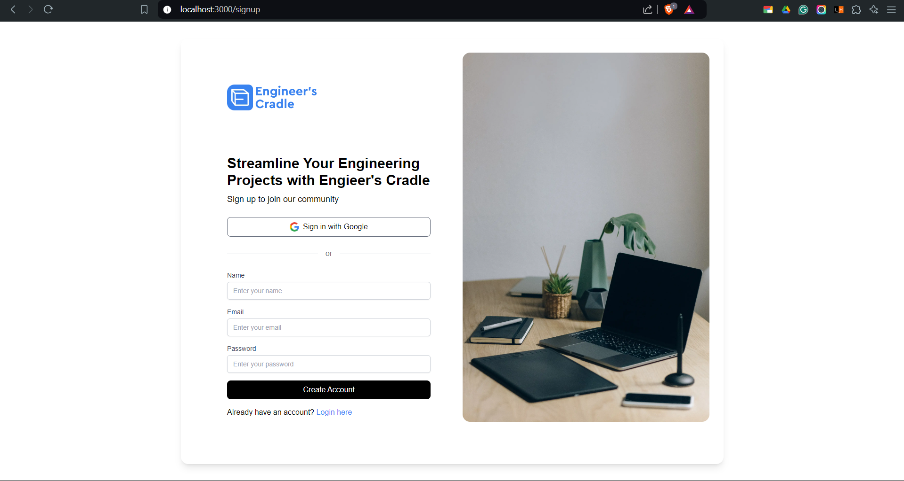
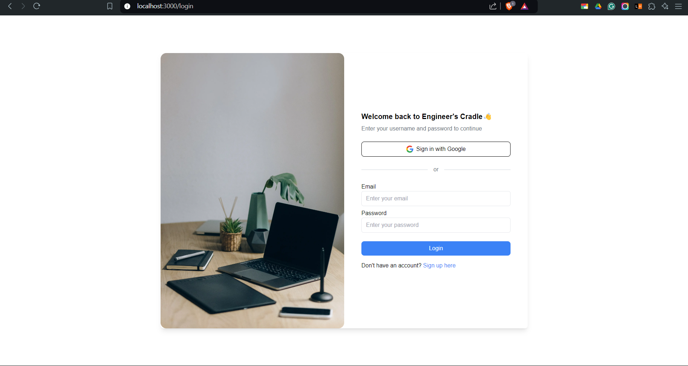
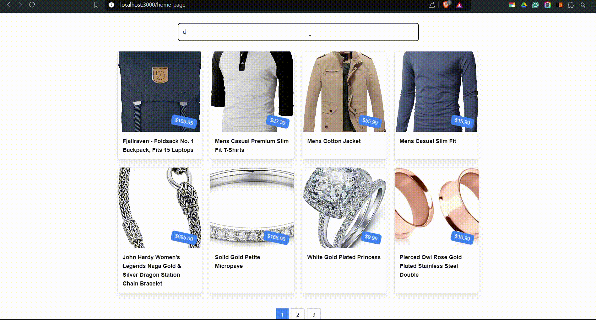

# Engineer-s_Cradle_Assignment

This project is a full-stack e-commerce application built with React, Next.js, and Node.js. It features user authentication (signup and login), a product listing page, and a private dashboard route. The application connects to a MongoDB database and uses JWT for user authentication.

## Features

- **User Authentication**: Sign up, login, and manage user sessions with JWT.
- **Product Listing**: Display products fetched from a fake API.
- **Responsive Design**: Works well on both desktop and mobile devices.
- **Protected Routes**: Use a private route to protect sensitive pages.

## Technologies Used

- **Frontend**: Typescript, Next.js, React, Tailwind CSS
- **Backend**: Node.js, Express
- **Database**: MongoDB
- **Authentication**: JWT

## Screenshots

### Signup Page

### Login Page

### Home Page

